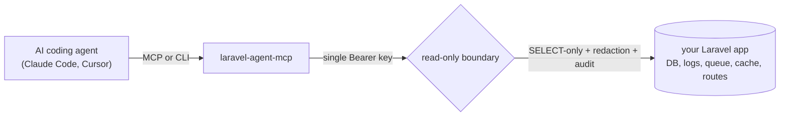

<!--
keywords: Laravel MCP server, Model Context Protocol, Claude Code Laravel, Cursor Laravel,
AI agent database access, read-only MCP, Laravel schema inspection, laravel ai agent tools,
mcp server php, laravel db mcp, safe database access for ai agents, laravel mcp cli
-->

# laravel-agent-mcp

A secure, read-only Model Context Protocol (MCP) server for Laravel. Give Claude Code, Cursor, and other AI coding agents safe live access to your app's database schema, queries, logs, queue, cache, routes, and config, instead of letting them guess from source files or stale training data.

[](https://packagist.org/packages/anilcancakir/laravel-agent-mcp)
[](https://github.com/anilcancakir/laravel-agent-mcp/actions/workflows/ci.yml)
[](https://packagist.org/packages/anilcancakir/laravel-agent-mcp)
[](https://packagist.org/packages/anilcancakir/laravel-agent-mcp)
[](LICENSE)

[Quick start](#quick-start) · [Why](#why-this-exists) · [Tools](#what-your-agent-can-see-25-read-only-tools) · [Two modes](#two-ways-to-connect-mcp-or-cli) · [Security](#security-model) · [FAQ](#faq)



## Why this exists

Your AI coding agent writes migrations, queries, and config lookups against a schema it has never actually seen. It invents column names, assumes relationships that no longer match your tables, and reasons about a queue and cache it cannot observe. The result is plausible, confident, and wrong.

laravel-agent-mcp closes that gap. It exposes a read-only endpoint on your running Laravel app so the agent reads the real schema, the real routes, the real env-key names, and the current queue state. The agent stops guessing and starts working from live truth.

The reason it is safe to point an agent at: there are no write tools. Not "writes are disabled by default," they do not exist. The agent cannot call something that is not there. On top of that, every database read runs through a read-only-hardened connection, a SELECT-only SQL validator, output redaction, and an audit log. You can hand the key to an agent and still explain the security model in a review.

## Quick start

```bash
composer require anilcancakir/laravel-agent-mcp
```

Run the installer to pick a mode and publish the config and agent assets:

```bash
php artisan agent-mcp:install
# Sail / Herd: vendor/bin/sail artisan agent-mcp:install
```

Set a server key (the endpoint is fail-closed and returns `401` until this is set):

```bash
php -r "echo bin2hex(random_bytes(32));"   # generate a strong key
```

```dotenv
# .env
AGENT_MCP_KEY=paste-the-generated-key-here
```

Ask your agent something it could not have guessed:

```bash
php artisan agent-mcp:call db_schema '{"table":"users"}'
echo '{"sql":"select count(*) as c from failed_jobs"}' | php artisan agent-mcp:call db_raw_select
```

That is the whole loop: install, set one key, and the agent has safe live context. The next section explains the two ways to wire it into an agent client.

### Agent guideline and skill injection

When laravel-boost is not installed, `agent-mcp:install` injects the mode-tailored guideline directly into each selected agent's instruction file and copies the active-mode skill into each agent's skills directory.

**What gets written**

The guideline is wrapped in a managed marker block and inserted into the instruction file:

```
<laravel-agent-mcp-guidelines>
... mode-correct guideline content ...
</laravel-agent-mcp-guidelines>
```

The injection is idempotent: re-running replaces the existing block in place, preserving everything outside it. If the file already has an unbalanced or duplicated `<laravel-agent-mcp-guidelines>` marker set, the command aborts with a clear error and leaves the file untouched.

The active-mode skill directory (`agent-mcp-investigation` for MCP mode, `agent-mcp-cli` for CLI mode) is written into each agent's skills path. On a mode switch, the previous mode's managed directory is removed and replaced with the new one. These directories are package-managed: they are overwritten on every re-run, so do not hand-edit them.

**Agent selection**

The installer targets the agents detected in the project by default (falling back to Claude Code when nothing is detected). You can override this:

```bash
# target specific agents by key
php artisan agent-mcp:install --agents=claude_code,cursor

# target all supported agents
php artisan agent-mcp:install --agents=all
```

Supported agent keys and their paths:

| Key | Guideline file | Skills dir |
|-----|---------------|------------|
| `claude_code` | `CLAUDE.md` | `.claude/skills` |
| `cursor` | `AGENTS.md` | `.cursor/skills` |
| `copilot` | `AGENTS.md` | `.github/skills` |
| `junie` | `AGENTS.md` | `.junie/skills` |
| `gemini` | `GEMINI.md` | `.agents/skills` |
| `codex` | `AGENTS.md` | `.agents/skills` |
| `opencode` | `AGENTS.md` | `.agents/skills` |
| `amp` | `AGENTS.md` | `.agents/skills` |
| `kiro` | `AGENTS.md` | `.kiro/skills` |
| `antigravity` | `AGENTS.md` | `.agents/skills` |

Agents that share a guideline file (`AGENTS.md`) or skill dir (`.agents/skills`) are written exactly once regardless of how many matching keys you select.

In an interactive terminal without `--agents`, the installer presents a multiselect with the detected agents pre-selected.

**Injection flags**

```bash
# skip injection entirely (no guideline or skill files are written)
php artisan agent-mcp:install --no-inject

# inject even when laravel-boost is installed
php artisan agent-mcp:install --inject
```

When laravel-boost is installed, the command defers to boost by default (prints the `boost:install` / `boost:update --discover` next-step). Pass `--inject` to write the assets directly regardless. Pass `--no-inject` to always skip writing agent files.

## Two ways to connect: MCP or CLI

You do not have to register one more MCP server if you do not want to. The package works in two modes, and the installer records your choice in a committed `.agent-mcp.json` so your team, CI, and laravel-boost all resolve the same setup.

```bash
php artisan agent-mcp:install --mode=mcp   # default
php artisan agent-mcp:install --mode=cli
```

**MCP mode (default).** Registers a full MCP server on your app over HTTP (and a local stdio bridge), prints the ready-to-paste `.mcp.json` blocks and the `claude mcp add` one-liner, and activates the `agent-mcp-investigation` boost skill. Use this when you want persistent, low-latency tool access across many turns of an interactive session.

**CLI mode.** No MCP server registration. The artisan commands (`agent-mcp:call`, `agent-mcp:tools`, `agent-mcp:schema`) call the tools directly, locally or against a remote server. Activates the `agent-mcp-cli` boost skill. Use this for one-off calls, scripts, CI pipelines, or when you do not want to expose an HTTP endpoint. To target a remote endpoint, record its URL during install:

```bash
php artisan agent-mcp:install --mode=cli --url=https://your-app.example.com
```

The URL is committed in `.agent-mcp.json` (the CLI equivalent of `.mcp.json`) and is read by every `agent-mcp:call` on that repo checkout. `AGENT_MCP_URL` in env overrides the committed value. The URL must be `https` (plain `http` is allowed only for loopback addresses). `AGENT_MCP_KEY` stays in env only and is never committed.

> [!WARNING]
> Committing a URL is a credential-routing decision: every `agent-mcp:call` will send the `AGENT_MCP_KEY` Bearer token to that host. Review changes to `.agent-mcp.json` `url` as you would review a secret.

> [!NOTE]
> Commit `.agent-mcp.json`. It records the chosen mode and, for CLI remote setups, the endpoint URL (`{"mode":"cli","version":1,"url":"https://..."}`) for the whole team. When the file is absent, the package defaults to `mcp`, so a missing file is never a breaking state.

After install, wire boost so it injects the active mode's skill and guideline:

```bash
php artisan boost:install
# or, if boost is already installed:
php artisan boost:update --discover
```

## What your agent can see: 25 read-only tools

Every tool is individually gated by `config('agent-mcp.tools.<name>')`. Sensitive tools are off by default; the operator opts in. Enable only what your agent use case needs.

### Database schema and queries

| Tool | What it does | Default |
|------|-------------|---------|
| `db_schema` | Lists tables, or returns columns, indexes, and foreign keys for one table. | On |
| `db_query` | Structured reads: find by id, where filter, or count, with bound parameters. | On |
| `db_raw_select` | Ad-hoc SELECT validated by a SELECT-only grammar parser, auto-limited, run read-only. | On |
| `db_index_health` | Index inventory per table; PG adds unused-index detection and seq-scan advisory. | On |
| `db_missing_fk_indexes` | Foreign-key columns without a covering index (PG and MySQL definitive, SQLite heuristic). | On |
| `db_table_sizes` | Row counts and storage sizes; PG adds dead-tuple stats. | On |
| `migrations_status` | Ran migrations grouped by batch (from the `migrations` table). | On |
| `db_slow_queries` | Top queries by mean execution time (PG `pg_stat_statements`, MySQL `performance_schema`). | **Off** |
| `db_active_locks` | Point-in-time blocked/blocking sessions (PG and MySQL). | **Off** |

### Logs and artisan

| Tool | What it does | Default |
|------|-------------|---------|
| `read_logs` | Tails the log channel with an optional level filter and output redaction. | On |
| `run_artisan` | Runs an artisan command from an exact, operator-defined allowlist. | **Off** (empty allowlist) |

### Queue

| Tool | What it does | Default |
|------|-------------|---------|
| `queue_backlog` | Pending job counts per connection and queue. | On |
| `queue_failed_jobs` | Failed job summary or per-row detail (job class, exception first line, `failed_at`). Payload is never emitted. | On |
| `horizon_status` | Horizon workload, metrics, and supervisor state. Returns `{available:false}` when Horizon is absent. | On |

### Cache

| Tool | What it does | Default |
|------|-------------|---------|
| `cache_status` | Store config, optimization state, opcache summary, session-overlap risk flag. | On |
| `cache_inspect` | Key metadata (exists, TTL, type); the raw value is gated behind `cache.allow_value_read` plus a block-list. | On (value gated) |
| `cache_keys` | Lists cache keys with TTLs (database and Redis); excludes session keys. | **Off** |

### Application introspection

| Tool | What it does | Default |
|------|-------------|---------|
| `list_routes` | All routes with methods, URI, name, controller, middleware, and filters. | On |
| `inspect_route` | Deep dive on one route by name or URI. | On |
| `app_about` | Versions, environment, drivers, opcache (mirrors `php artisan about`). | On |
| `schedule_list` | Scheduled events with cron expression, next run, and flags. | On |
| `event_list` | Registered listeners (including wildcards); flags `ShouldQueue` and `ShouldBroadcast`. | On |
| `storage_info` | Disk config (credentials stripped) and symlink map. | On |
| `env_keys` | Environment variable names only. Values are never returned. | On |
| `config_inspect` | Config key tree with types; values are triple-gated (opt-in + safe-list + block-list). | **Off** |

Every call is audited (tool name and argument shape, never values) and passes through best-effort output redaction.

## How it works

1. The agent (or your shell) calls a tool by name with a JSON argument object.
2. In MCP mode, the HTTP route checks the single Bearer key first and fails closed. In CLI mode, shell access is the trust boundary.
3. The tool runs read-only: database reads go through a hardened read-only connection, `db_raw_select` passes a SELECT-only validator, and output is redacted.
4. The result returns as JSON. In CLI mode, content goes to stdout, diagnostics to stderr, and the exit code reflects whether the tool reported an error.

## Client setup (MCP mode)

### HTTP transport (remote / production)

```json
{
    "mcpServers": {
        "agent-mcp": {
            "type": "http",
            "url": "https://your-app.com/agent-mcp",
            "headers": { "Authorization": "Bearer YOUR_KEY_HERE" }
        }
    }
}
```

Or register it with the Claude CLI (required when using Laravel Boost):

```bash
claude mcp add --transport http https://your-app.com/agent-mcp --header "Authorization: Bearer YOUR_KEY_HERE"
```

### stdio bridge (Claude Desktop)

Claude Desktop does not send custom HTTP headers. Use the built-in `agent-mcp:stdio` bridge: a local artisan process that reads JSON-RPC from stdin, forwards each line to the remote endpoint with the Bearer key, and writes the reply to stdout. The key travels only in the Authorization header (never to stdout or stderr), and TLS verification is always on.

```json
{
    "mcpServers": {
        "agent-mcp": {
            "type": "stdio",
            "command": "php",
            "args": ["artisan", "agent-mcp:stdio"],
            "env": {
                "AGENT_MCP_URL": "https://your-app.com/agent-mcp",
                "AGENT_MCP_KEY": "YOUR_KEY_HERE"
            }
        }
    }
}
```

## CLI usage (CLI mode)

Three commands call the tools directly, honoring the same per-tool flags, audit log, and redaction as the HTTP endpoint:

```bash
php artisan agent-mcp:tools                 # list callable tools (--all includes disabled ones)
php artisan agent-mcp:schema db_query       # print a tool's input schema
php artisan agent-mcp:call db_schema '{"table":"users"}'
php artisan agent-mcp:call app_about --raw | jq '.environment'
```

By default the command runs the tool in-process (local mode). Remote mode is auto-selected when a remote URL is configured: either a `url` committed in `.agent-mcp.json` (set via `agent-mcp:install --url=`) or the `AGENT_MCP_URL` env variable (env takes precedence). Set `AGENT_MCP_KEY` in env to provide the Bearer token. `--local` and `--remote` force the choice. The key travels only in the Authorization header, never in command output. The URL must be `https` (loopback `http` excepted); a configured `http://` non-loopback URL errors loudly rather than falling back to local.

> [!WARNING]
> Sensitive tools (`config_inspect`, `db_slow_queries`, `db_active_locks`, `cache_keys`, `run_artisan`) can land in terminal scrollback. `agent-mcp:call` refuses to print a sensitive tool's result to a terminal unless you pass `--allow-tty`; piping or redirecting is always allowed. Do not add `agent-mcp:*` to the `run_artisan` allowlist.

## Security model

Read this before deploying to production. The read-only guarantee is not a single flag; it is several independent layers, so a failure in one does not breach the boundary.

### Authentication: fail-closed server key

The endpoint is protected by a single server-admin key (`AGENT_MCP_KEY`), not Sanctum, not a user model, not a database table. The check is fail-closed: when the key is unset or empty, every request is rejected with `401` before any comparison runs (this closes the `hash_equals('', '')` fail-open). The comparison is constant-time. The key is read only from server config/env; the stdio bridge sources it only from operator-set ENV, never from request data.

The header defaults to `Authorization`. Override it with `AGENT_MCP_KEY_HEADER` for non-standard clients.

### Read-only database boundary

1. A SELECT-only statement validator rejects any non-SELECT SQL, parsed as a token tree (not a regex), so stacked statements and file functions are refused.
2. Per-engine session hardening is applied once per connection: `PRAGMA query_only = ON` (SQLite), `SET default_transaction_read_only = on` (PostgreSQL), `SET SESSION max_execution_time = <ms>` (MySQL). `PDO::ATTR_EMULATE_PREPARES` is asserted `false` (emulated prepares allow stacked queries).
3. On the default-connection fallback, the package clones the connection config into an ephemeral `agent-mcp-readonly` connection and hardens the clone only; the shared default connection is never mutated.
4. A dedicated readonly DB user (strongly recommended) is an independent, grant-level boundary that holds even if the application layer has a bug.

> [!NOTE]
> MySQL has no per-session read-only mode for a normal user, so a readonly GRANT matters most there. See [Read-only database access](#read-only-database-access) below for the exact MySQL, PostgreSQL, and SQLite grants.

### Redaction is best-effort, not a guarantee

Output redaction replaces detected secrets (emails, Bearer tokens, JWTs, AWS keys, card numbers, password-like pairs) with `[REDACTED]` in every tool response. It is defense-in-depth, not the boundary: novel or encoded secrets pass through, and an LLM can be instructed to exfiltrate in ways redaction cannot catch. The read-only grant is what prevents writes and file reads; redaction only reduces accidental exposure in output.

### app.debug warning

Never expose the endpoint with `APP_DEBUG=true`. The package strips stack traces from MCP error responses regardless of the flag, but Laravel debug pages and toolbars can leak config, bindings, and env to any client that reaches the endpoint. Set `APP_DEBUG=false` in production, or restrict the endpoint to an internal network during local debugging.

### Sensitive-tool opt-in model

`config_inspect`, `db_slow_queries`, `db_active_locks`, and `cache_keys` are off by default because they can surface sensitive information. Value-returning tools (`config_inspect`, `cache_inspect`) gate values twice: an explicit opt-in flag (`reveal_values`, `cache.allow_value_read`), then a block-list that unconditionally redacts known-sensitive dot-paths. The block-list always wins, even with explicit opt-in.

## Read-only database access

All database access goes through a read-only-hardened connection. A dedicated readonly DB user is strongly recommended as an independent control.

### PostgreSQL

```sql
CREATE ROLE agent_readonly LOGIN PASSWORD 'strong-password-here';
GRANT SELECT ON ALL TABLES IN SCHEMA public TO agent_readonly;
ALTER DEFAULT PRIVILEGES IN SCHEMA public GRANT SELECT ON TABLES TO agent_readonly;
```

Do not add the role to `pg_read_server_files`, do not grant `COPY` or `lo_*` (large object) privileges, and do not add it to `pg_execute_server_program`. For full `db_slow_queries` and `db_active_locks` visibility, grant `pg_monitor` (or `pg_read_all_stats` on pre-10), and enable `pg_stat_statements` in `postgresql.conf`.

### MySQL

```sql
CREATE USER 'agent_readonly'@'localhost' IDENTIFIED BY 'strong-password-here';
GRANT SELECT ON your_database.* TO 'agent_readonly'@'localhost';
FLUSH PRIVILEGES;
```

Do not grant `FILE`, `SUPER`, `INSERT`, `UPDATE`, `DELETE`, or `DROP`. For `db_slow_queries`, also `GRANT SELECT ON performance_schema.* TO 'agent_readonly'@'localhost';`.

### SQLite

SQLite has no grant system. The package sets `PRAGMA query_only = ON`; for defense-in-depth, open the file read-only via the DSN:

```php
'readonly' => [
    'driver'   => 'sqlite',
    'database' => database_path('your.sqlite'),
    'options'  => [\PDO::SQLITE_ATTR_OPEN_FLAGS => \PDO::SQLITE_OPEN_READONLY],
],
```

### Pointing the package at a readonly connection

Add a `readonly` connection to `config/database.php`, then set:

```dotenv
AGENT_MCP_DB_CONNECTION=readonly
```

When `connection` is null (the default), the package clones the app's default connection into a hardened ephemeral `agent-mcp-readonly` connection; the shared default is never modified.

## Laravel Boost integration

The package ships boost-discoverable assets that `boost:install` and `boost:update --discover` pick up automatically. Which skill and guideline branch are active depends on the mode in `.agent-mcp.json`.

| Asset | Active in |
|-------|-----------|
| `resources/boost/skills/agent-mcp-investigation/SKILL.blade.php` | MCP mode |
| `resources/boost/skills/agent-mcp-cli/SKILL.blade.php` | CLI mode |
| `resources/boost/guidelines/core.blade.php` | Both (mode-branched) |

Full mode-filtering (only the active mode's skill is injected) needs a boost version with `SKILL.blade.php` support. On older boost, both `SKILL.md` fallbacks install unfiltered (functional, not mode-tailored). Boost does not auto-wire third-party MCP servers ([laravel/boost#522](https://github.com/laravel/boost/issues/522)); bind the server via `agent-mcp:install` or `claude mcp add`.

Each skill also carries an optional, opt-in community prompt: after a verified end-to-end investigation the agent may offer to star the repo, and after a genuine package-side bug it may offer to open an issue. Both are prose-permission only, capped at once per session, and never auto-executed (no `gh` call without your explicit yes on a visible draft). The executable detail lives in each skill's `references/community.md`.

**Without boost:** `agent-mcp:install` injects the assets directly. See [Agent guideline and skill injection](#agent-guideline-and-skill-injection) above.

## How this compares

laravel-agent-mcp is complementary to the official Laravel AI packages, not a replacement.

| | laravel-agent-mcp | laravel/mcp | laravel/boost | raw read-only DB user |
|---|---|---|---|---|
| Purpose | Give agents read-only access to a running app | SDK to build your own MCP server | Dev-time agent context on localhost | Direct SQL access |
| Ready-made tools | 25 (DB, logs, queue, cache, routes, config) | None (you build them) | ~15 dev tools | None |
| Read-only enforcement | SELECT validator + hardened connection + redaction | You implement it | DB query tool runs any SQL | DB grant only |
| Auth | Single Bearer key, no Sanctum/user/DB | Sanctum / OAuth (your wiring) | Local stdio, no auth | DB credentials |
| CLI + remote | Yes (`agent-mcp:call`, local and remote) | Local stdio | Local stdio | n/a |
| Boost skill shipped | Yes | n/a | n/a | No |
| Production-safe remote | Yes | Depends on your wiring | Dev-only | Yes, but raw SQL |

### Not for you if

- You need the agent to write to the database. This package has no write tools by design.
- You are building a custom MCP server with your own domain tools. Use `laravel/mcp` directly.
- You only need local dev-time context and already run `laravel/boost`. Boost may be enough on its own.

## FAQ

### How do I give Claude Code read-only access to my Laravel database?

Install the package, run `php artisan agent-mcp:install`, set `AGENT_MCP_KEY` in `.env`, and add the printed `.mcp.json` block to Claude Code (or run `claude mcp add`). The agent then calls `db_schema`, `db_query`, and `db_raw_select`, all read-only.

### Is this safe to use against a production database?

Yes, with the documented setup: set `APP_DEBUG=false`, use a dedicated readonly DB user, and keep sensitive tools off. There are no write tools, database reads run on a read-only-hardened connection, and `db_raw_select` is validated SELECT-only. Treat redaction as a bonus, not the boundary.

### Can the agent write to or delete from my database?

No. The package defines no write tools, so there is nothing to call. The read-only connection and SELECT-only validator are additional independent layers, and a readonly DB grant is the recommended final control.

### Do I need Laravel Sanctum or a user table?

No. Auth is a single server-admin key in `.env`. It works on a fresh server, in CI, and on staging before any user tables exist. You can swap in your own middleware if you prefer.

### Does this work with Cursor and other MCP clients?

Yes. Any client that supports HTTP MCP transport works with the HTTP endpoint. Claude Desktop (no custom headers) uses the built-in `agent-mcp:stdio` bridge.

### How is this different from Laravel Boost?

Boost is a dev-time tool for coding agents on your local machine, and its database query tool can run any SQL. laravel-agent-mcp is a production-safe, read-only, key-authenticated server with a 25-tool ops suite and a CLI, designed for remote and server-admin use. They are complementary.

### What databases are supported?

MySQL, PostgreSQL, and SQLite. MariaDB is not officially supported because its statement-timeout syntax differs from MySQL's.

## Requirements

| PHP | Laravel | laravel/mcp |
|-----|---------|-------------|
| 8.3, 8.4, 8.5 | 11, 12, 13 | `>=0.6 <0.8` |

The `laravel/mcp` pin is intentional: it is pre-1.0 with breaking changes between minors, so the tight constraint prevents silent upgrades to an incompatible API. Check the changelog before widening it.

## For AI agents

This repository is AI-readiness aware:

- [`llms.txt`](llms.txt): a machine-readable index of what the package is and where its docs live.
- In a consumer project, `agent-mcp:install` injects the package guideline into the selected agents' instruction files (`CLAUDE.md`, `AGENTS.md`, `GEMINI.md`) and copies the active-mode skill into each agent's skills directory, so the agent learns how to use the tools. See [Agent guideline and skill injection](#agent-guideline-and-skill-injection).

## Changelog

See [CHANGELOG](CHANGELOG.md) for the release history and notable changes.

## Contributing

Issues and pull requests are welcome. Run the suite with `composer test`, the linter with `vendor/bin/pint`, and static analysis with `composer analyse` before opening a PR. Tests ship green on PHP 8.3 to 8.5, Laravel 11 to 13, and both laravel/mcp 0.6 and 0.7.

## Security vulnerabilities

Please report security issues through GitHub's private vulnerability reporting on this repository rather than a public issue.

## License

The MIT License (MIT). See [LICENSE](LICENSE) for details.
